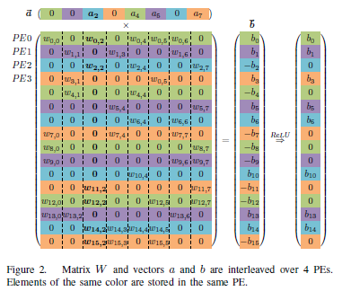
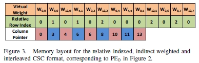
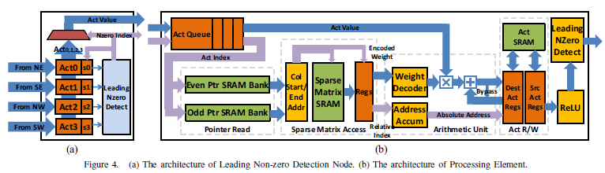

### EIE: Efficient Inference Engine on Compressed Deep Neural Network

全连接层稀疏加速器，利用了输入的动态稀疏性、权重的静态稀疏性。

对于向量矩阵乘法，EIE将一行权重分配给一个PE，下图中相同颜色数据存储在相同PE中。

对向量a进行遍历，每次广播非零的a_i和index i到所有PE，以上图为例，首先选出a_2，PE0将其乘w_{0,2}和w_{12,2}，PE1不运算，PE2将其乘w_{2,2}和w_{14,2}，PE3将其乘w_{11,2}和w_{15,2}。

使用CSC格式存储稀疏矩阵，以PE0为例，它存储的权重格式如下图所示：

EIE整体结构：

